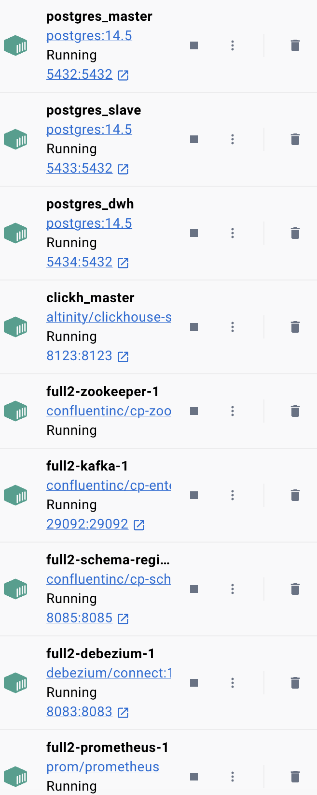

# DWH_HSE_23

## Процедура запуска

1. Осуществить клонирование текущего репозитория 
2. В терминале изменить рабочий каталог на папку с репозиторием: 

```bash
cd /path/to/your/dir/with/files/from/github
```

3. Выполнить в терминале следующую команду: `sh docker-init.sh`

## Содержание

### Часть №1
- Поднят инстанс PostgreSQL в Docker
- Написан DDL для [структуры](https://github.com/hdrbv/DWH_HSE_23/blob/main/Full_Structure.pdf) в [SQL](https://github.com/hdrbv/DWH_HSE_23/blob/main/createdb.sql)
- Настроена автоматическая инициализация

    

_Структура схемы (terminal screenshot)_

- Поднята реплика в docker-compose, настроена репликация


_Проверка запроса на master (terminal screenshot)_

<br>
    
    
_Проверка запроса на replica (terminal screenshot)_    
<br>
    

_Insert на master передает данные на replica (terminal screenshot)_    

- Реализован скрипт, который считает GMV (Gross Merchandise Value) и отдает таблицу в заданном формате (_store_id | category_id | sales_sum_) с превращением скрипта выше во [view](https://github.com/hdrbv/DWH_HSE_23/blob/main/createview.sql)

        
_Созданная view GMV (DBeaver screenshot)_    

### Часть №2
- Добавлены новые поля в изначальную структуру
- Данные детального слоя сложены в схему **dwh_detailed** на отдельном инстансе Postgre

            
_Структура схемы **dwh_detailed** на Postgres (DBeaver screenshot)_    

- Создана ER-диаграмма проинициализированный [структуры](./Full_Structure_Det_DWH.pdf)
- Также осуществлена инициализация **dwh_detailed** на ClickHouse, выбранном по следующим причинам:
    - столбцовое хранение данных
    - физическая сортировка данных по первичному ключу
    - векторные вычисления по участкам столбцов
    - децентрализация и отсутствие единой точки отказа
    - разработка Yandex (поддержим отечественного производителя :))
    
    Данные пункты (за исключением крайнего) ведут естественным образом к б*o*льшей скорости и высокой устойчивости) 

    
_Структура схемы **dwh_detailed** на Clickhouse (DBeaver screenshot)_    

- Поднят и подключен debezium к master-хосту сервиса (IN PROGRESS)

            
    
    _Подключенный debezium  (Safari screenshot)_    


            
    
    _Состояние развернутого debezium и debezium-ui (Docker screenshot)_            

- Реализован на Python [DMP-сервис](https://github.com/hdrbv/DWH_HSE_23/blob/main/DMP_service.py), который посажен в Docker-Compose 


### Часть №3 
- Поднят [Apache Airflow](./airflow) в docker-compose 
- Созданы [DAG](./airflow/dags) для Airflow

### Часть №4 
- Поднята Grafana

            
    
    _Grafana -- connection page (Safari screenshot)_            

- Поднят Shiny с дэшбордами:

            
    
    _Аналитический дэшборд по GMV (Safari screenshot. NB: don't forget to update page http://localhost:3838)_            

            
    
    _Аналитический дэшборд по клиентам (Safari screenshot. NB: don't forget to update page http://localhost:3838)_            

    [Демо](./evidences/video.mov) дэшбордов:

<video width="320" height="240" controls>
  <source src="./evidences/video.mov" type="video/mp4">
</video>

## Итого

Все сервисы запустились, состояние - healthy. 

        
        

***


